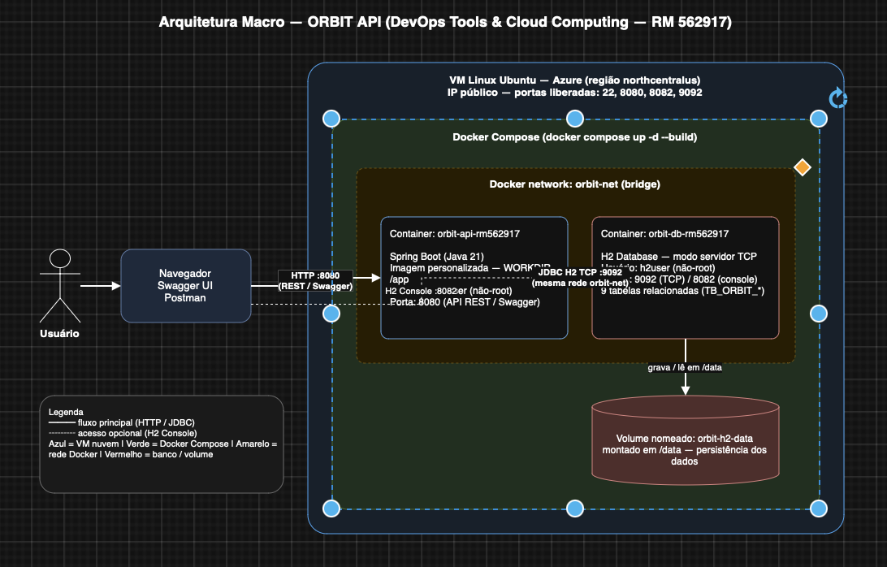

# ORBIT API - DevOps Tools & Cloud Computing

Henrique Rodrigues Vespasiano — RM562917
Ruan Luca Feliciano — RM562218
Mirelly Sousa Alves — RM566299
Gabriely Bonfim Silva — RM566242

## Descrição da solução

A ORBIT API é uma aplicação Java Spring Boot voltada ao contexto da Global Solution 2026/1, conectando exploração espacial, dados e soluções aplicáveis a problemas reais na Terra.

Fluxo: o usuário acessa a aplicação via navegador/Swagger/Postman, que chega a uma VM Linux na nuvem (Azure). Na VM, o Docker Compose orquestra dois containers na mesma rede `orbit-net`: o container da aplicação `orbit-api-rm562917` (Spring Boot, porta 8080) e o container do banco `orbit-db-rm562917` (H2 em modo servidor TCP, portas 9092/8082). A persistência é garantida pelo volume nomeado `orbit-h2-data`, montado em `/data` no container do banco.

## Arquitetura macro



## Tecnologias utilizadas

- Java 21
- Spring Boot
- Spring Data JPA
- Spring Security
- Swagger/OpenAPI
- H2 Database
- Docker
- Docker Compose

## Como executar o projeto

### 1. Clonar o repositório

```bash
git clone https://github.com/HenriqueRodriguesV/DevOpsGS
cd DevOpsGS
```

### 2. Subir os containers em background

```bash
docker compose up -d --build
```

### 3. Verificar os containers rodando

```bash
docker compose ps
```

### 4. Exibir logs dos dois containers

```bash
# mostra os últimos logs e devolve o terminal (não trava)
docker compose logs --tail 30 orbit-api
docker compose logs --tail 30 orbit-db

# para acompanhar em tempo real, use -f e saia com Ctrl+C
# docker compose logs -f orbit-api
```

### 5. Entrar nos containers

```bash
docker container exec -it orbit-api-rm562917 sh
docker container exec -it orbit-db-rm562917 sh
```

### 6. Mostrar `pwd`, `ls -l` e `whoami`

```bash
docker container exec -it orbit-api-rm562917 pwd
docker container exec -it orbit-api-rm562917 ls -l
docker container exec -it orbit-api-rm562917 whoami

docker container exec -it orbit-db-rm562917 pwd
docker container exec -it orbit-db-rm562917 ls -l
docker container exec -it orbit-db-rm562917 whoami
```

### 7. Acessar Swagger

- `http://localhost:8080/swagger-ui.html`

### 8. Acessar H2 Console

- `http://localhost:8082`
- JDBC URL: `jdbc:h2:tcp://localhost:9092/./orbitdb`

### 9. Evidência de persistência com `SELECT`

```bash
# Mostra as pessoas gravadas (inclui as criadas no CRUD)
docker exec orbit-db-rm562917 sh -c 'java -cp h2.jar org.h2.tools.Shell -url jdbc:h2:tcp://localhost:9092/./orbitdb -user sa -password "" -sql "select id, nome, funcao from TB_ORBIT_PESSOA"'

# Lista todas as tabelas (9 tabelas relacionadas)
docker exec orbit-db-rm562917 sh -c 'java -cp h2.jar org.h2.tools.Shell -url jdbc:h2:tcp://localhost:9092/./orbitdb -user sa -password "" -sql "show tables"'
```

### 10. Executar testes

```bash
cd orbit-api
mvn test
```

## Observações

- O projeto usa variáveis de ambiente para banco e JWT.
- A imagem da arquitetura macro deve ser adicionada na pasta `arquitetura/`.

## Testando o CRUD completo (com autenticação JWT)

Os endpoints de dados exigem token JWT. Fluxo: **registrar/login -> usar o token**.

> **Importante:** o token JWT expira em 24h. **Nunca cole um token "fixo"** — capture o token na hora com os comandos abaixo. Foi esse o erro que dava `403` na demonstração.

### Passo 1 — Registrar e capturar o token automaticamente

```bash
# Registra e já guarda o token na variável TOKEN (não precisa copiar/colar nada)
TOKEN=$(curl -s -X POST http://localhost:8080/api/auth/registrar \
  -H "Content-Type: application/json" \
  -d '{"nome":"Rep RM562917","email":"rep@orbit.com","senha":"orbit123"}' \
  | sed -n 's/.*"token":"\([^"]*\)".*/\1/p')

echo "$TOKEN"   # deve imprimir um token (eyJ...). Se vier vazio, o e-mail já existe: faça o login abaixo
```

Se o e-mail já estiver cadastrado (ao repetir a gravação), pegue o token via **login**:

```bash
TOKEN=$(curl -s -X POST http://localhost:8080/api/auth/login \
  -H "Content-Type: application/json" \
  -d '{"email":"rep@orbit.com","senha":"orbit123"}' \
  | sed -n 's/.*"token":"\([^"]*\)".*/\1/p')

echo "$TOKEN"
```

### Passo 2 — CREATE (criar pessoa)

```bash
curl -s -X POST http://localhost:8080/api/pessoas \
  -H "Authorization: Bearer $TOKEN" \
  -H "Content-Type: application/json" \
  -d '{"nome":"Astronauta Teste","matricula":"RM562917","funcao":"Comandante","nivelCondicaoFisica":9,"nivelHabilidade":8}'
```

> Anote o `"id"` retornado (ex.: `"id":5`). Use esse mesmo id no UPDATE e no DELETE.

### Passo 3 — READ (listar)

```bash
curl -s -H "Authorization: Bearer $TOKEN" http://localhost:8080/api/pessoas
```

### Passo 4 — UPDATE (troque o `5` pelo id do seu CREATE)

```bash
curl -s -X PUT http://localhost:8080/api/pessoas/5 \
  -H "Authorization: Bearer $TOKEN" \
  -H "Content-Type: application/json" \
  -d '{"nome":"Astronauta Atualizado","matricula":"RM562917","funcao":"Piloto","nivelCondicaoFisica":10,"nivelHabilidade":10}'
```

### Passo 5 — DELETE (troque o `5` pelo id do seu CREATE)

```bash
curl -s -o /dev/null -w "HTTP %{http_code}\n" -X DELETE \
  -H "Authorization: Bearer $TOKEN" http://localhost:8080/api/pessoas/5
# Esperado: HTTP 204
```

Outros recursos: `/api/missoes`, `/api/veiculos`, `/api/recursos`, `/api/pontos-apoio` (ver Swagger).

> **Dica:** todos os campos numéricos de pessoa (`nivelCondicaoFisica`, `nivelHabilidade`) vão de **0 a 10**. Fora disso a API retorna `400`.

## Como executar em nuvem (Azure)

Deploy em VM Linux Ubuntu via Azure CLI, região `northcentralus`. Há scripts em `scripts/`.

```bash
# automatizado (requer: az login)
bash scripts/azure-create-vm.sh        # cria RG/VM, abre portas 8080/8082/9092, instala Docker e sobe os containers
```

Passo a passo manual na VM:

```bash
ssh azureuser@IP_DA_VM
sudo apt update && sudo apt install -y git
curl -fsSL https://get.docker.com -o get-docker.sh && sudo sh get-docker.sh
sudo systemctl enable docker && sudo systemctl start docker
git clone https://github.com/HenriqueRodriguesV/DevOpsGS.git
cd DevOpsGS
sudo docker compose up -d --build
sudo docker compose ps
```

Portas liberadas na nuvem: 22 (SSH), 8080 (API/Swagger), 8082 (H2 Console), 9092 (H2 TCP).

Acessos em nuvem:
- Swagger: `http://IP_DA_VM:8080/swagger-ui.html`
- H2 Console: `http://IP_DA_VM:8082`
- youtube: https://youtu.be/GWHj5jUUiKU
Remover os recursos da nuvem (evitar custos): `bash scripts/azure-delete-resources.sh`
